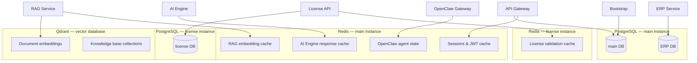

# Databases

UniCore uses three database technologies: **PostgreSQL 16** for relational data (with four distinct Prisma schemas), **Redis 7** for caching and session management, and **Qdrant** for vector embeddings used by the RAG service.

## Database Topology



## PostgreSQL Schemas

### 1. Main Database — API Gateway Schema

**Schema file**: `unicore/services/api-gateway/src/prisma/schema.prisma`
**Services**: API Gateway, Bootstrap

| Model | Purpose | Key Fields |
|-------|---------|-----------|
| `User` | Platform users | `email` (unique), `role` (Role enum), `password`, has many `Session` and `Notification` |
| `Session` | JWT sessions | `token`, `refreshToken`, `expiresAt`, `userId` FK |
| `CustomDomain` | Tenant custom domains | `hostname` (unique), `tenantId`, `isVerified`, `allowedOrigins` |
| `AuditLog` | Security audit trail | `userId`, `action`, `resource`, `resourceId`, `ip`, `success` |
| `Settings` | Key-value platform config | Single `default` row, `data` JSON blob |
| `Task` | Task board items | `status`, `priority`, `labels`, `assigneeId`, `creatorId`, `progress` |
| `ChatHistory` | Agent conversation history | `agentId`, `userId`, `messages` JSON, `channel`, `summary` |
| `Notification` | User notification inbox | `userId` FK, `type` (info/warning/success/error), `title`, `message`, `read`, `link` |

**Role enum**:
```
OWNER → OPERATOR → MARKETER → FINANCE → VIEWER
```

### 2. ERP Database — ERP Schema

**Schema file**: `unicore/services/erp/src/prisma/schema.prisma`
**Services**: ERP Service
**Note**: Separate database from the main database. Must be created manually before first push.

```sql
CREATE DATABASE <erp-database-name> OWNER <db-user>;
```

#### CRM Module

| Model | Purpose | Key Fields |
|-------|---------|-----------|
| `Contact` | Persons and organisations | `type` (ContactType), `leadStage`, `leadScore` (0-100), `dealValue`, `parentId` (hierarchy) |
| `ContactNote` | Interaction log | `type` (call/email/meeting/task/note), `body`, `authorId` |

**ContactType enum**: `LEAD → PROSPECT → CUSTOMER → PARTNER → VENDOR → ARCHIVED`

**LeadStage enum**: `NEW → CONTACTED → QUALIFIED → PROPOSAL → NEGOTIATION → CLOSED_WON / CLOSED_LOST`

#### Inventory Module

| Model | Purpose | Key Fields |
|-------|---------|-----------|
| `Product` | SKUs, pricing, catalogues | `sku` (unique), `unitPrice`, `costPrice`, `taxRate`, `type` (physical/digital/service) |
| `Warehouse` | Storage locations | `code` (unique), `status` (ACTIVE/INACTIVE), `isDefault` |
| `InventoryItem` | Stock per product per warehouse | `quantityOnHand`, `quantityReserved`, `quantityAvailable`, `reorderPoint` |
| `StockMovement` | Immutable stock change audit log | `type` (StockMovementType), `quantity` (delta), `balanceAfter` |

**StockMovementType enum**: `PURCHASE`, `SALE`, `RETURN_IN`, `RETURN_OUT`, `ADJUSTMENT_ADD`, `ADJUSTMENT_REMOVE`, `TRANSFER_IN`, `TRANSFER_OUT`, `WRITE_OFF`

#### Orders Module

| Model | Purpose | Key Fields |
|-------|---------|-----------|
| `Order` | Sales order lifecycle | `orderNumber`, `status` (OrderStatus), `fulfillmentStatus`, `total`, `channel` |
| `OrderItem` | Line items (snapshot pricing) | `sku`, `name`, `quantity`, `unitPrice`, `lineTotal`, `qtyFulfilled`, `qtyReturned` |
| `Fulfillment` | Shipment events | `status` (FulfillmentStatus), `carrier`, `trackingNumber`, `shippedAt`, `deliveredAt` |

**OrderStatus lifecycle**: `DRAFT → QUOTED → CONFIRMED → PROCESSING → PARTIALLY_FULFILLED → FULFILLED → SHIPPED → DELIVERED → RETURNED / CANCELLED / REFUNDED`

**FulfillmentStatus**: `PENDING → PICKING → PACKED → DISPATCHED → IN_TRANSIT → DELIVERED / FAILED / RETURNED`

#### Invoicing Module

| Model | Purpose | Key Fields |
|-------|---------|-----------|
| `Invoice` | Billing documents | `invoiceNumber`, `status` (InvoiceStatus), `dueDate`, `amountDue`, `isRecurring`, `recurringTemplateId` |
| `InvoiceLine` | Invoice line items | `description`, `quantity`, `unitPrice`, `taxRate`, `lineTotal`, `sortOrder` |
| `Payment` | Payment records (partial support) | `amount`, `method` (PaymentMethod), `gateway`, `transactionId`, `paidAt` |

**InvoiceStatus**: `DRAFT → SENT → VIEWED → PARTIALLY_PAID → PAID / OVERDUE / VOID / WRITTEN_OFF`

**PaymentMethod enum**: `CASH`, `BANK_TRANSFER`, `CREDIT_CARD`, `DEBIT_CARD`, `STRIPE`, `PAYPAL`, `PROMPTPAY`, `QR_CODE`, `CRYPTO`, `OTHER`

**RecurrenceInterval**: `DAILY`, `WEEKLY`, `BIWEEKLY`, `MONTHLY`, `QUARTERLY`, `SEMIANNUAL`, `ANNUAL`

#### Expenses Module

| Model | Purpose | Key Fields |
|-------|---------|-----------|
| `Expense` | Business expense records | `category` (ExpenseCategory), `status` (ExpenseStatus), `amount`, `exchangeRate`, `baseAmount`, `receiptUrl`, `ocrConfidence` |

**ExpenseStatus**: `DRAFT → SUBMITTED → APPROVED / REJECTED → REIMBURSED`

#### Reports Module

| Model | Purpose | Key Fields |
|-------|---------|-----------|
| `Report` | Saved report definitions | `type` (ReportType), `period`, `filters` JSON, `data` JSON, `isScheduled`, `scheduleAt` (cron) |
| `ReportSnapshot` | Immutable computed snapshots | `version`, `data` JSON — append-only |

**ReportType enum**: `PROFIT_AND_LOSS`, `CASH_FLOW`, `BALANCE_SHEET`, `SALES_SUMMARY`, `INVENTORY_SUMMARY`, `EXPENSE_SUMMARY`, `ACCOUNTS_RECEIVABLE`, `ACCOUNTS_PAYABLE`, `CUSTOM`

### 3. License Database — License Schema

**Schema file**: `unicore-license/services/license-api/prisma/schema.prisma`
**Services**: License API (isolated stack — separate PostgreSQL + Redis)

| Model | Purpose | Key Fields |
|-------|---------|-----------|
| `License` | License keys | `key` (unique, `UC-XXXX-XXXX-XXXX-XXXX`), `edition` (community/pro), `expiry`, `maxAgents`, `maxRoles`, 10 feature flag booleans |
| `MachineBinding` | Hardware fingerprints | `cpuId`, `macAddress`, `diskId`, `hash` (SHA-256), `active` |
| `AuditLog` | License operation log | `action` (AuditAction enum), `meta` JSON, `ip` |
| `FeatureFlag` | Global platform feature flags | `key` (unique), `enabled` |

**License feature flags** (10 boolean fields on `License`):
`featAllAgents`, `featCustomAgentBuilder`, `featFullRbac`, `featAdvancedWorkflows`, `featAllChannels`, `featUnlimitedRag`, `featWhiteLabelBranding`, `featSso`, `featAuditLogs`, `featPrioritySupport`

**AuditAction enum**: `CREATED`, `UPDATED`, `REVOKED`, `VALIDATED`, `BIND_SUCCESS`, `BIND_FAILED`, `UNBIND`, `ANALYTICS_RECEIVED`

### 4. Pro Package Schemas

The `unicore-pro/` repo includes additional Prisma schemas for Pro-only features:

| Package | Schema location | Key Models |
|---------|----------------|-----------|
| `audit` | `unicore-pro/packages/audit/prisma/schema.prisma` | Extended audit logging |
| `domains` | `unicore-pro/packages/domains/prisma/schema.prisma` | Custom domain routing |
| `rbac` | `unicore-pro/packages/rbac/prisma/schema.prisma` | Fine-grained role-based access |
| `sso` | `unicore-pro/packages/sso/prisma/schema.prisma` | SSO identity providers |

## PostgreSQL Views (ERP)

The ERP schema uses Prisma's `previewFeature: ["views"]` to map three read-only PostgreSQL views:

### `v_pnl_monthly` → `PnlMonthly`

Monthly profit-and-loss aggregation. Revenue is derived from paid `Invoice` totals; expenses from approved `Expense` amounts.

| Column | Type | Description |
|--------|------|-------------|
| `month` | `String` | `"YYYY-MM"` bucket, e.g. `"2025-03"` (unique) |
| `currency` | `Char(3)` | ISO-4217 currency code |
| `totalRevenue` | `Decimal(18,4)` | Sum of paid invoice amounts |
| `totalExpenses` | `Decimal(18,4)` | Sum of approved expense amounts |
| `grossProfit` | `Decimal(18,4)` | `totalRevenue - totalExpenses` |

### `v_ar_aging` → `ArAging`

Accounts-receivable aging. Classifies outstanding `Invoice.amountDue` into standard collection buckets.

| Column | Type | Description |
|--------|------|-------------|
| `id` | `Uuid` | Invoice ID (unique) |
| `invoiceNumber` | `String` | Human-readable reference |
| `contactName` | `String` | Customer name |
| `total` | `Decimal(18,4)` | Original invoice total |
| `amountDue` | `Decimal(18,4)` | Remaining unpaid balance |
| `daysOverdue` | `Int` | Days past due date |
| `agingBucket` | `String` | `"current"`, `"1-30"`, `"31-60"`, `"61-90"`, `"90+"` |

### `v_low_stock_alert` → `LowStockAlert`

Inventory items at or below their reorder point. Polled by the ERP service to emit `inventory.low` Kafka events.

| Column | Type | Description |
|--------|------|-------------|
| `id` | `Uuid` | InventoryItem ID (unique) |
| `sku` | `String` | Product SKU |
| `productName` | `String` | Product display name |
| `warehouseName` | `String` | Warehouse name |
| `quantityAvailable` | `Int` | Current sellable stock |
| `reorderPoint` | `Int` | Threshold that triggered the alert |
| `reorderQty` | `Int` | Suggested purchase quantity |

## Redis Usage

The main Redis instance (`unicores-unicore-redis-1`, host port `6380`) is shared by multiple services. The license stack has its own isolated Redis (`unicores-unicore-license-redis-1`).

| Service | Redis Usage | Key Patterns |
|---------|------------|--------------|
| API Gateway | JWT session cache, refresh token store | `session:<userId>`, `token:<jti>` |
| AI Engine | Model response cache, rate limit state | `ai:cache:<hash>`, `ai:ratelimit:<key>` |
| RAG Service | Embedding cache, job queue | `rag:embed:<hash>`, `rag:queue` |
| OpenClaw Gateway | Agent state, connected client registry | `agent:<agentId>:state`, `clients:<sessionId>` |
| Workflow Engine | Workflow instance state | `workflow:<instanceId>` |
| License API | License validation cache (isolated Redis) | `license:<key>:valid`, `license:<key>:flags` |

## Qdrant Vector Database

**Container**: `unicores-unicore-vectordb-1`
**Port**: `6333` (HTTP + gRPC)
**Internal URL**: `http://unicore-vectordb:6333`
**Volume**: `vectordb_data`

Qdrant stores vector embeddings produced by the RAG service. Each knowledge base topic is stored as a named collection. The RAG service manages collection creation, document chunking, embedding generation, and similarity search queries.

| Concept | Description |
|---------|------------|
| Collection | Logical group of vectors — one per knowledge base |
| Vector | Float array from an LLM embedding model |
| Payload | JSON metadata attached to each vector (source URL, chunk text, doc ID) |
| Search | Cosine / dot-product nearest-neighbour queries |

## Prisma Workflow

UniCore uses `prisma db push` (schema introspection mode) instead of migration files. This is faster for early development but means schema changes are applied directly to the live database without a migration history.

```bash
# Push API Gateway schema (main DB)
docker exec unicores-unicore-api-gateway-1 npx prisma db push --accept-data-loss

# Push ERP schema (unicore_erp DB — must exist first)
docker exec unicores-unicore-postgres-1 psql -U unicore -d postgres \
  -c "CREATE DATABASE unicore_erp OWNER unicore;"
docker exec unicores-unicore-erp-1 npx prisma db push --accept-data-loss

# Restart services after schema changes
docker compose --profile apps restart unicore-api-gateway unicore-erp
```

The `--accept-data-loss` flag is required when `db push` needs to drop and recreate columns that cannot be altered in place. Use with caution in production.
