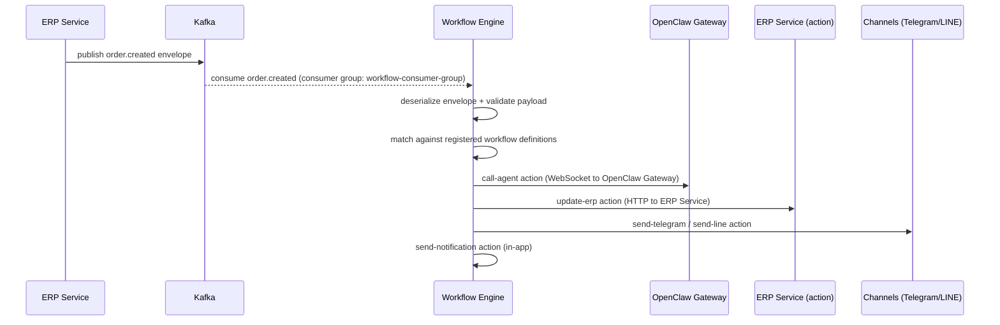

# Messaging

UniCore uses **Apache Kafka 7.5** (via KafkaJS 2.2) as its internal event streaming bus. The ERP service publishes domain events when business objects change state; the Workflow Engine consumes those events and executes configured automation actions.

## Kafka Infrastructure

| Compose Service | Image | Port |
|----------------|-------|------|
| `unicore-kafka` | `confluentinc/cp-kafka:7.5.0` | `9092` (internal) |
| `unicore-zookeeper` | `confluentinc/cp-zookeeper:7.5.0` | `2181` (internal only) |

Both Kafka and Zookeeper are started only when the `workflows` Docker Compose profile is active:

```bash
docker compose --profile apps --profile workflows up -d
```

### Kafka Configuration (Broker)

| Parameter | Value |
|-----------|-------|
| `KAFKA_BROKER_ID` | `1` |
| `KAFKA_ZOOKEEPER_CONNECT` | `unicore-zookeeper:2181` |
| `KAFKA_ADVERTISED_LISTENERS` | `PLAINTEXT://unicore-kafka:9092` |
| `KAFKA_OFFSETS_TOPIC_REPLICATION_FACTOR` | `1` |

Replication factor is 1 (single-broker development setup). For production HA, increase to 3 with a multi-broker cluster.

## Topics

The ERP service is the authoritative producer for all domain events. Topic names follow the pattern `<domain>.<event>`:

| Topic | Producer | Consumers | Description |
|-------|----------|----------|-------------|
| `order.created` | ERP Service | Workflow Engine | New order placed |
| `order.updated` | ERP Service | Workflow Engine | Order status changed |
| `order.fulfilled` | ERP Service | Workflow Engine | Order fully fulfilled/shipped |
| `inventory.low` | ERP Service | Workflow Engine | Stock at or below reorder point |
| `inventory.restocked` | ERP Service | Workflow Engine | Stock replenished |
| `invoice.created` | ERP Service | Workflow Engine | New invoice issued |
| `invoice.overdue` | ERP Service | Workflow Engine | Invoice past due date |
| `invoice.paid` | ERP Service | Workflow Engine | Invoice fully paid |

## Event Envelope Format

All events are wrapped in a standard envelope for tracing and routing:

```typescript
interface EventEnvelope<T> {
  eventId: string;       // UUID — deduplicate consumers
  eventType: string;     // e.g. "order.created"
  occurredAt: string;    // ISO-8601 timestamp
  source: string;        // originating service, e.g. "erp"
  payload: T;            // domain-specific payload (see below)
}
```

## Event Payloads

### `order.created`

Published when a new `Order` record transitions out of `DRAFT` status.

| Field | Type | Description |
|-------|------|-------------|
| `orderId` | `string` | UUID of the order |
| `customerId` | `string` | Contact UUID |
| `customerEmail` | `string?` | Optional contact email |
| `status` | `OrderStatus` | Current order status |
| `lineItems` | `OrderLineItemDto[]` | Array of line items (productId, sku, quantity, unitPrice, totalPrice) |
| `subtotal` | `number` | Sum before tax |
| `tax` | `number` | Tax amount |
| `total` | `number` | Grand total |
| `currency` | `string` | ISO-4217 code |

### `order.updated`

Published on any status change to an existing order.

| Field | Type | Description |
|-------|------|-------------|
| `orderId` | `string` | UUID of the order |
| `customerId` | `string` | Contact UUID |
| `previousStatus` | `OrderStatus` | Status before the change |
| `newStatus` | `OrderStatus` | Status after the change |
| `notes` | `string?` | Optional change notes |
| `updatedFields` | `Record<string, unknown>?` | Map of changed field values |

### `order.fulfilled`

Published when an `Order` is marked as `FULFILLED` or `SHIPPED`.

| Field | Type | Description |
|-------|------|-------------|
| `orderId` | `string` | UUID of the order |
| `customerId` | `string` | Contact UUID |
| `trackingNumber` | `string?` | Carrier tracking reference |
| `carrier` | `string?` | Carrier name |
| `fulfilledAt` | `string` | ISO-8601 fulfillment timestamp |

### `inventory.low`

Published when `InventoryItem.quantityAvailable <= reorderPoint`. The ERP service polls the `v_low_stock_alert` PostgreSQL view to identify items below threshold.

| Field | Type | Description |
|-------|------|-------------|
| `productId` | `string` | Product UUID |
| `productName` | `string` | Product display name |
| `sku` | `string` | Product SKU |
| `currentQuantity` | `number` | Current available stock |
| `threshold` | `number` | Reorder point that triggered the alert |
| `warehouseId` | `string?` | Warehouse UUID (if applicable) |
| `supplierId` | `string?` | Preferred supplier contact UUID |

### `inventory.restocked`

Published when a `StockMovement` of type `PURCHASE` or `ADJUSTMENT_ADD` is recorded.

| Field | Type | Description |
|-------|------|-------------|
| `productId` | `string` | Product UUID |
| `productName` | `string` | Product display name |
| `sku` | `string` | Product SKU |
| `previousQuantity` | `number` | Stock level before restock |
| `quantityAdded` | `number` | Units added |
| `newQuantity` | `number` | Stock level after restock |
| `warehouseId` | `string?` | Warehouse UUID |
| `purchaseOrderId` | `string?` | Reference purchase order UUID |

### `invoice.created`

Published when a new `Invoice` is created and sent (status transitions from `DRAFT` to `SENT`).

| Field | Type | Description |
|-------|------|-------------|
| `invoiceId` | `string` | Invoice UUID |
| `customerId` | `string` | Contact UUID |
| `orderId` | `string?` | Linked order UUID |
| `status` | `InvoiceStatus` | Current invoice status |
| `amount` | `number` | Subtotal |
| `tax` | `number` | Tax amount |
| `total` | `number` | Grand total |
| `currency` | `string` | ISO-4217 code |
| `dueDate` | `string` | ISO-8601 due date |
| `issuedAt` | `string` | ISO-8601 issue timestamp |

### `invoice.overdue`

Published by a scheduled job when `Invoice.dueDate` has passed and `Invoice.status` is not `PAID`.

| Field | Type | Description |
|-------|------|-------------|
| `invoiceId` | `string` | Invoice UUID |
| `customerId` | `string` | Contact UUID |
| `total` | `number` | Invoice total |
| `currency` | `string` | ISO-4217 code |
| `dueDate` | `string` | ISO-8601 due date |
| `daysOverdue` | `number` | Days past the due date (≥ 1) |
| `customerEmail` | `string?` | Contact email for notifications |

### `invoice.paid`

Published when a `Payment` record is added that brings `Invoice.amountDue` to zero.

| Field | Type | Description |
|-------|------|-------------|
| `invoiceId` | `string` | Invoice UUID |
| `customerId` | `string` | Contact UUID |
| `amountPaid` | `number` | Total amount received |
| `currency` | `string` | ISO-4217 code |
| `paidAt` | `string` | ISO-8601 payment timestamp |
| `paymentMethod` | `string?` | Payment method used |
| `transactionId` | `string?` | Gateway transaction ID |

## Workflow Engine — Event Flow



## KafkaJS Consumer Configuration

The Workflow Engine uses the NestJS Kafka microservice transport backed by KafkaJS.

| Parameter | Default | Env var | Description |
|-----------|---------|---------|-------------|
| `clientId` | `workflow-service` | `KAFKA_CLIENT_ID` | Kafka client identifier |
| `brokers` | `localhost:9092` | `KAFKA_BROKERS` | Comma-separated broker list |
| `groupId` | `workflow-consumer-group` | `KAFKA_CONSUMER_GROUP_ID` | Consumer group |
| `connectionTimeout` | `3000` ms | `KAFKA_CONNECTION_TIMEOUT` | Initial connection timeout |
| `requestTimeout` | `30000` ms | `KAFKA_REQUEST_TIMEOUT` | Per-request timeout |
| `retry.initialRetryTime` | `100` ms | `KAFKA_RETRY_INITIAL_RETRY_TIME` | First retry backoff |
| `retry.retries` | `8` | `KAFKA_RETRY_RETRIES` | Maximum retry attempts |
| `subscribe.fromBeginning` | `false` | — | Start from latest offset |

All topics are subscribed at startup via `SUBSCRIBED_TOPICS = Object.values(WORKFLOW_TOPICS)`.

## Topic-to-Consumer Mapping

```
order.created       → OrderConsumerService.handleOrderCreated()
order.updated       → OrderConsumerService.handleOrderUpdated()
order.fulfilled     → OrderConsumerService.handleOrderFulfilled()
inventory.low       → InventoryConsumerService.handleInventoryLow()
inventory.restocked → InventoryConsumerService.handleInventoryRestocked()
invoice.created     → InvoiceConsumerService.handleInvoiceCreated()
invoice.overdue     → InvoiceConsumerService.handleInvoiceOverdue()
invoice.paid        → InvoiceConsumerService.handleInvoicePaid()
```

Each consumer method:
1. Reads raw bytes from `KafkaContext.getMessage().value`
2. Deserializes and validates the `EventEnvelope` wrapper
3. Deserializes and validates the domain-specific payload DTO using `class-validator`
4. Delegates to `EventHandlerService.handle()` → `WorkflowService.handleEvent()`

## Workflow Action Executors

When a workflow definition matches an incoming event, one or more action executors run in sequence:

| Executor | Action type | Transport |
|----------|------------|-----------|
| `CallAgentExecutor` | `call-agent` | WebSocket to OpenClaw Gateway |
| `UpdateErpExecutor` | `update-erp` | HTTP to ERP Service |
| `SendTelegramExecutor` | `send-telegram` | Telegram Bot API |
| `SendLineExecutor` | `send-line` | LINE Messaging API |
| `SendNotificationExecutor` | `send-notification` | In-app push (Redis pub/sub) |

## Zookeeper

Zookeeper (`unicores-unicore-zookeeper-1`) is the coordination layer for the single-node Kafka broker. It manages broker registration, topic metadata, and consumer group offsets.

| Parameter | Value |
|-----------|-------|
| Image | `confluentinc/cp-zookeeper:7.5.0` |
| Client port | `2181` (internal only) |
| `ZOOKEEPER_CLIENT_PORT` | `2181` |
| Profile | `workflows` |

In a production multi-broker deployment, Zookeeper would be replaced with KRaft (Kafka's built-in metadata quorum, available from Kafka 3.3+), eliminating the Zookeeper dependency entirely.
