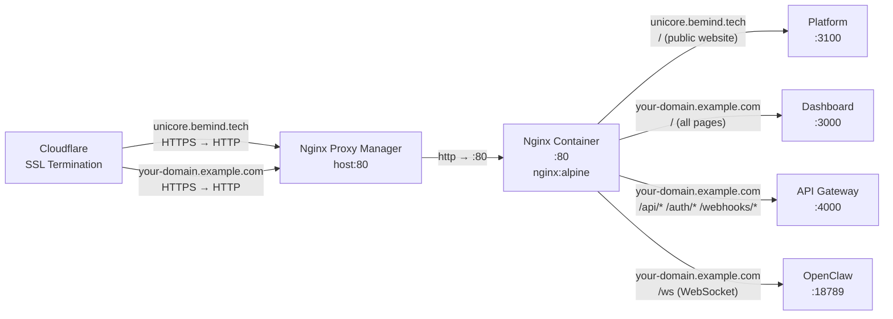

# Networking

## Traffic Flow — External to Internal



All inbound traffic enters via Cloudflare, which provides SSL/TLS termination and DNS for both `unicore.bemind.tech` and your dashboard domain. Cloudflare forwards decrypted HTTP to **Nginx Proxy Manager** (NPM), which proxies both subdomains to the internal Nginx container. Nginx uses two server blocks: `unicore.bemind.tech` routes all traffic to the Platform service (public website), while your dashboard domain uses path-based routing to reach the Dashboard, API Gateway, and OpenClaw services.

## Nginx Proxy Manager

NPM manages the external proxy hosts for both subdomains:

| Setting | Value |
|---------|-------|
| Admin UI | Access NPM admin on port 81 (configure credentials on first login) |
| Proxy target (`unicore.bemind.tech`) | `<nginx-container>:80` |
| Proxy target (your dashboard domain) | `<nginx-container>:80` |

Both proxy hosts are pointed at the internal Nginx container by service DNS name. NPM and the Nginx container share the external `nginx-proxy` Docker network.

## Internal Nginx Routing

Config file location: `unicore/nginx/default.conf` (mounted read-only into the container at `/etc/nginx/conf.d/default.conf`).

### Route Table

**Server block: `unicore.bemind.tech`** (public website)

| Path pattern | Upstream | Notes |
|-------------|----------|-------|
| `/` (catch-all) | `unicore-platform:3100` | Public website — landing, pricing, showcases |

**Server block: `your-domain.example.com`** (dashboard + API)

| Path pattern | Upstream | Notes |
|-------------|----------|-------|
| `/api/` | `unicore-api-gateway:4000` | All REST API v1 calls |
| `/auth/` | `unicore-api-gateway:4000` | Login, logout, token refresh |
| `/webhooks/` | `unicore-api-gateway:4000` | Channel webhook ingestion |
| `/ws` | `unicore-openclaw-gateway:18789` | WebSocket upgrade |
| `/` (catch-all) | `unicore-dashboard:3000` | All other pages |

### WebSocket Configuration

The `/ws` location performs an HTTP → WebSocket upgrade:

```nginx
location /ws {
    proxy_pass http://openclaw_ws;     # → <openclaw-service>:<port>
    proxy_http_version 1.1;
    proxy_set_header Upgrade $http_upgrade;
    proxy_set_header Connection "upgrade";
    proxy_read_timeout 86400;          # 24-hour idle timeout for long-lived connections
}
```

The dashboard also uses HTTP upgrade headers on the catch-all `/` location to support Next.js hot-module replacement in development.

### Upstream Definitions

```nginx
upstream dashboard    { server unicore-dashboard:3000; }
upstream platform     { server unicore-platform:3100; }
upstream api          { server unicore-api-gateway:4000; }
upstream openclaw_ws  { server unicore-openclaw-gateway:18789; }
```

Nginx resolves these names via Docker's internal DNS using service names defined in `docker-compose.yml`.

## Docker Networks

```mermaid
graph TD
  subgraph default [Docker default network — unicores_default]
    GW[API Gateway :4000]
    ERP[ERP :4100]
    AI[AI Engine :4200]
    RAG[RAG :4300]
    BS[Bootstrap :4500]
    LIC[License API :4600]
    OC[OpenClaw :18789/18790]
    WF[Workflow :4400]
    DASH[Dashboard :3000]
    PLAT[Platform :3100]
    DLC[DLC Gateway :19789/19790]
    PG[(PostgreSQL :5432)]
    RD[(Redis :6379)]
    QD[(Qdrant :6333)]
    KF[Kafka :9092]
    ZK[Zookeeper :2181]
    LDB[(License DB)]
    LRD[(License Redis)]
    NGX[Nginx :80]
  end

  subgraph external [nginx-proxy network — external]
    NPM[Nginx Proxy Manager]
    NGX
  end
```

All containers share a single default Docker Compose network (`unicores_default`). This allows every container to reach every other container by service name. The Nginx container additionally joins the external `nginx-proxy` network so NPM can forward traffic to it.

### External Network Declaration

```yaml
networks:
  nginx-proxy:
    external: true
```

The `nginx-proxy` network must be created before the first `docker compose up`:

```bash
docker network create nginx-proxy
```

## Internal DNS

Within the Docker default network, services communicate by their Compose service name. Each service is reachable at `<service-name>:<port>` using Docker's internal DNS resolver. Service names and ports are defined in `docker-compose.yml`.

| Service type | Protocol |
|-------------|----------|
| PostgreSQL databases | PostgreSQL |
| Redis instances | Redis |
| Vector database | HTTP/gRPC |
| Message broker | Kafka protocol |
| Coordinator | Zookeeper |
| Application services (API, ERP, AI, RAG, Bootstrap, License) | HTTP |
| WebSocket gateways | WebSocket + HTTP |
| Frontend services (Dashboard, Platform) | HTTP |

## Port Map

### Exposed to Host

| Host port | Container port | Service | Protocol |
|-----------|---------------|---------|----------|
| `80` | `80` | `unicore-nginx` | HTTP (proxied through NPM + Cloudflare) |
| `3000` | `3000` | `unicore-dashboard` | HTTP |
| `4000` | `4000` | `unicore-api-gateway` | HTTP |
| `4100` | `4100` | `unicore-erp` | HTTP |
| `4200` | `4200` | `unicore-ai-engine` | HTTP |
| `4300` | `4300` | `unicore-rag` | HTTP |
| `4500` | `4500` | `unicore-bootstrap` | HTTP |
| `4600` | `4600` | `unicore-license-api` | HTTP |
| `5433` | `5432` | `unicore-postgres` | PostgreSQL |
| `6333` | `6333` | `unicore-vectordb` | HTTP/gRPC |
| `6380` | `6379` | `unicore-redis` | Redis |
| `9092` | `9092` | `unicore-kafka` | Kafka |
| `18790` | `18790` | `unicore-openclaw-gateway` | HTTP |
| `3100` | `3100` | `unicore-platform` | HTTP |
| `19789` | `19789` | `unicore-dlc-gateway` | WebSocket |
| `19790` | `19790` | `unicore-dlc-gateway` | HTTP |

### Internal Only (Not Exposed to Host)

| Internal port | Service | Protocol |
|-------------|---------|----------|
| `2181` | `unicore-zookeeper` | Zookeeper |
| `4400` | `unicore-workflow` | HTTP |
| `18789` | `unicore-openclaw-gateway` | WebSocket |
| `5432` | `unicore-license-db` | PostgreSQL |
| `6379` | `unicore-license-redis` | Redis |

## Header Propagation

All Nginx proxy locations forward these headers to downstream services:

| Header | Value |
|--------|-------|
| `Host` | `$host` |
| `X-Real-IP` | `$remote_addr` |
| `X-Forwarded-For` | `$proxy_add_x_forwarded_for` |
| `X-Forwarded-Proto` | `$scheme` |

These headers allow backend services to log the real client IP and detect whether the original request was HTTPS.
