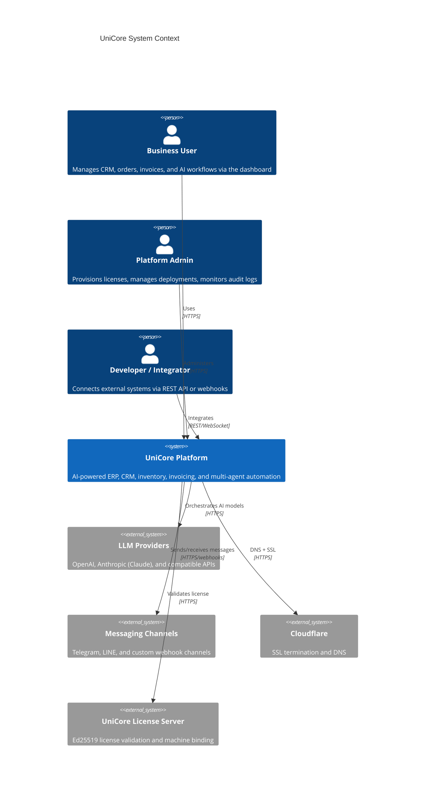
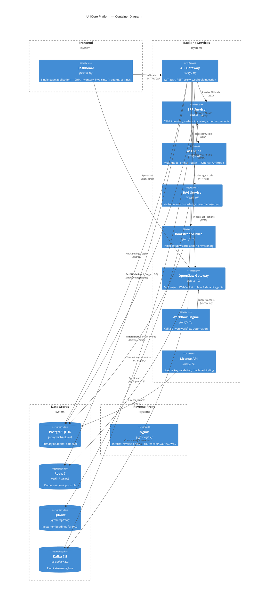
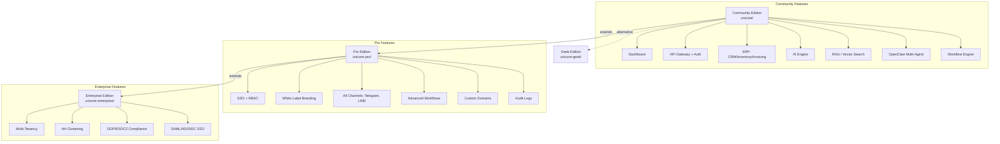

# Architecture Overview

Updated: 2026-03-22

UniCore is a modular, AI-powered business platform built on a multi-repo monorepo structure. It ships in multiple editions — from an open-core community release through enterprise clustering — all sharing the same container topology and service contracts.

## C4 Model — System Context



## C4 Model — Container Diagram



## Multi-Repo Structure

UniCore is maintained across eight GitHub repositories, five of which are active submodules in the production deployment:

```
unicores/                          (root workspace — production compose)
├── unicore/                       BSL 1.1   — Community edition
├── unicore-pro/                   BSL 1.1   — Pro extensions
├── unicore-license/               Proprietary — License server
├── unicore-enterprise/            Proprietary — Enterprise clustering & compliance
├── unicore-geek/                  BSL 1.1   — Terminal-first TUI edition
├── unicore-ai-dlc/                BSL 1.1   — AI Developer Lifecycle Chat
├── unicore-platform/              BSL 1.1   — Public website (landing, pricing, showcases)
└── unicore-ecosystem-docs/        CC BY 4.0 — This documentation
```

| Repo | GitHub | License | Purpose |
|------|--------|---------|---------|
| `unicore` | github.com/bemindlabs/unicore | BSL 1.1 | Open-core platform: dashboard, API gateway, ERP, AI engine, RAG, OpenClaw, workflow |
| `unicore-pro` | github.com/bemindlabs/unicore-pro | BSL 1.1 | Pro packages: SSO, RBAC, AUDIT, advanced workflows, all channels, white-label, custom domains |
| `unicore-license` | github.com/bemindlabs/unicore-license | Proprietary | License server: Ed25519-signed keys, machine binding, feature flag enforcement |
| `unicore-enterprise` | github.com/bemindlabs/unicore-enterprise | Proprietary | Multi-tenancy, HA clustering, GDPR/SOC2 compliance, SAML/AD/OIDC enterprise SSO |
| `unicore-geek` | github.com/bemindlabs/unicore-geek | BSL 1.1 | Terminal-first edition: TUI dashboard, REPL console, game mode, no web UI |
| `unicore-ai-dlc` | github.com/bemindlabs/unicore-ai-dlc | BSL 1.1 | AI Developer Lifecycle Chat: distributed WebSocket gateway for developer workflows |
| `unicore-platform` | github.com/bemindlabs/unicore-platform | BSL 1.1 | Public website: landing pages, pricing, showcases (Next.js 16, port 3100) |

## Edition Model



The `UNICORE_EDITION` environment variable (`community`, `pro`, `full`) controls which feature branches are active at runtime. Pro feature flags (`ENABLE_SSO`, `ENABLE_WHITE_LABEL`, `ENABLE_ALL_CHANNELS`, etc.) are injected via Docker Compose.

## Tech Stack Summary

| Layer | Technology | Version |
|-------|-----------|---------|
| Frontend | Next.js + React + TypeScript | 14.2 / 18.3 / 5.5 |
| Frontend UI | Tailwind CSS + shadcn/ui | — |
| Backend | NestJS + Node.js + TypeScript | 10.4 / 20+ / 5.5 |
| ORM | Prisma (`db push`, not migrations) | 6 |
| Auth | Passport.js (JWT + local strategy) | — |
| Primary DB | PostgreSQL | 16 |
| Cache / Sessions | Redis | 7 |
| Vector DB | Qdrant | latest |
| Event Streaming | Apache Kafka + Zookeeper | 7.5 (KafkaJS 2.2) |
| AI Providers | OpenAI, Anthropic (Claude) | — |
| Build System | Turborepo + pnpm workspaces | 2.0 / 10.30+ |
| Container Runtime | Docker + Docker Compose | — |
| Reverse Proxy | Nginx | alpine |
| License Crypto | Ed25519 signing + SHA-256 fingerprinting | — |
| Testing | Jest (unit), Playwright (E2E), SuperTest | 29 / 1.58 |
| Package Namespace | `@unicore/*` (community+pro), `@unicore-license/*` | — |

## Repository Structure (unicore)

The `unicore/` repository follows a Turborepo monorepo layout:

```
unicore/
├── apps/
│   └── dashboard/             Next.js 16 frontend (port 3000)
├── services/
│   ├── api-gateway/           NestJS REST + auth (port 4000)
│   ├── erp/                   NestJS ERP: CRM, inventory, invoicing (port 4100)
│   ├── ai-engine/             NestJS AI model orchestration (port 4200)
│   ├── rag/                   NestJS vector search + Qdrant (port 4300)
│   ├── bootstrap/             NestJS wizard + initial setup (port 4500)
│   ├── openclaw-gateway/      Multi-agent WebSocket (port 18789/18790)
│   └── workflow/              Kafka-based workflow engine (port 4400)
├── packages/
│   ├── shared-types/          Shared TypeScript interfaces
│   ├── config/                Configuration management
│   ├── ui/                    shadcn/ui component library
│   └── integrations/          3rd-party API wrappers
└── nginx/
    └── default.conf           Nginx reverse proxy config
```
