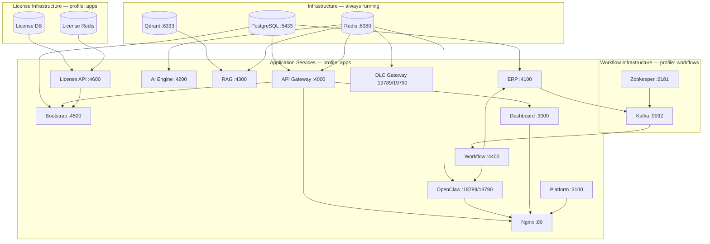

# Services

UniCore runs 19 Docker containers, grouped into infrastructure services (always up), application services (started via the `apps` profile), and workflow services (started via the `workflows` profile).

## Service Inventory

| Service | Container | Port (host:container) | Framework | Profile | Source |
|---------|----------|----------------------|-----------|---------|--------|
| Dashboard | `unicores-unicore-dashboard-1` | `3000:3000` | Next.js 14 | `apps` | Build from source |
| API Gateway | `unicores-unicore-api-gateway-1` | `4000:4000` | NestJS 10 | `apps` | Build from source |
| ERP | `unicores-unicore-erp-1` | `4100:4100` | NestJS 10 | `apps` | Build from source |
| AI Engine | `unicores-unicore-ai-engine-1` | `4200:4200` | NestJS 10 | `apps` | Build from source |
| RAG | `unicores-unicore-rag-1` | `4300:4300` | NestJS 10 | `apps` | Build from source |
| Bootstrap | `unicores-unicore-bootstrap-1` | `4500:4500` | NestJS 10 | `apps` | Build from source |
| License API | `unicores-unicore-license-api-1` | `4600:4600` | NestJS 10 | `apps` | Build from source |
| Workflow | `unicores-unicore-workflow-1` | — (4400 internal) | NestJS 10 | `workflows` | Build from source |
| OpenClaw Gateway | `unicores-unicore-openclaw-gateway-1` | `18790:18790` | NestJS 10 | `apps` | Build from source |
| Platform | `unicores-unicore-platform-1` | `3100:3100` | Next.js 14 | `apps` | Build from source |
| DLC Gateway | `unicores-unicore-dlc-gateway-1` | `19789:19789`, `19790:19790` | NestJS 10 | `apps` | Build from source |
| Nginx | `unicores-unicore-nginx-1` | `80:80` | nginx:alpine | `apps` | Pulled image |
| PostgreSQL | `unicores-unicore-postgres-1` | `5433:5432` | postgres:16-alpine | — (always) | Pulled image |
| Redis | `unicores-unicore-redis-1` | `6380:6379` | redis:7-alpine | — (always) | Pulled image |
| Qdrant | `unicores-unicore-vectordb-1` | `6333:6333` | qdrant/qdrant | — (always) | Pulled image |
| Kafka | `unicores-unicore-kafka-1` | `9092:9092` | cp-kafka:7.5.0 | `workflows` | Pulled image |
| Zookeeper | `unicores-unicore-zookeeper-1` | `2181` (internal) | cp-zookeeper:7.5.0 | `workflows` | Pulled image |
| License DB | `unicores-unicore-license-db-1` | — (internal) | postgres:16-alpine | `apps` | Pulled image |
| License Redis | `unicores-unicore-license-redis-1` | — (internal) | redis:7-alpine | `apps` | Pulled image |

## Service Descriptions

### Dashboard (`unicore-dashboard`)
Next.js 14 single-page application. Serves all UI pages: CRM contacts, orders, invoices, inventory, AI agent chat, workflow builder, settings, and the setup wizard. Built with Tailwind CSS and shadcn/ui. Communicates exclusively via the API Gateway and the OpenClaw WebSocket endpoint.

- **Build context**: `./unicore` — `apps/dashboard/Dockerfile`
- **Key env**: `NEXT_PUBLIC_API_URL`, `NEXT_PUBLIC_EDITION`, `NEXT_PUBLIC_BOOTSTRAP_SECRET`

### API Gateway (`unicore-api-gateway`)
The single entry point for all REST calls. Handles JWT-based authentication (Passport.js local + JWT strategies), proxies requests downstream to ERP, AI Engine, RAG, Bootstrap, and OpenClaw, and ingests channel webhooks (Telegram, LINE). Persists users, sessions, tasks, chat history, audit logs, and settings in the primary PostgreSQL database.

- **Build context**: `./unicore` — `services/api-gateway/Dockerfile`
- **Key env**: `DATABASE_URL` (main DB), `REDIS_URL`, `JWT_SECRET`, `BOOTSTRAP_SECRET`
- **Downstream**: ERP `:4100`, AI Engine `:4200`, RAG `:4300`, Bootstrap `:4500`, OpenClaw `:18790`

### ERP Service (`unicore-erp`)
Handles all business operations: CRM (contacts, lead scoring), product catalogue, multi-warehouse inventory, order lifecycle management, invoicing, payment recording, expense tracking, and scheduled reporting. Publishes Kafka events on order, inventory, and invoice state changes. Uses a dedicated PostgreSQL database (`unicore_erp`).

- **Build context**: `./unicore` — `services/erp/Dockerfile`
- **Key env**: `DATABASE_URL` (`unicore_erp` DB), `KAFKA_BROKERS`, `REDIS_URL`

### AI Engine (`unicore-ai-engine`)
Orchestrates calls to multiple LLM providers (OpenAI, Anthropic). Manages model selection, prompt routing, and response streaming. Redis is used for caching model responses and managing rate-limit state.

- **Build context**: `./unicore` — `services/ai-engine/Dockerfile`
- **Key env**: `OPENAI_API_KEY`, `ANTHROPIC_API_KEY`, `REDIS_URL`
- **Pro flags**: `ENABLE_ADVANCED_MODELS`, `ENABLE_FINE_TUNING`

### RAG Service (`unicore-rag`)
Manages the knowledge base for retrieval-augmented generation. Accepts documents, chunks and embeds them, stores vectors in Qdrant, and answers semantic search queries. Redis is used for embedding cache and job queuing.

- **Build context**: `./unicore` — `services/rag/Dockerfile`
- **Key env**: `QDRANT_URL` (`http://unicore-vectordb:6333`), `REDIS_URL`

### Bootstrap Service (`unicore-bootstrap`)
Provides the first-run setup wizard. Accepts the bootstrap secret for initial admin provisioning, configures the platform settings, and coordinates with the License API to validate and bind a license on first launch. Wizard lock state is stored as a settings key in PostgreSQL.

- **Build context**: `./unicore` — `services/bootstrap/Dockerfile`
- **Key env**: `BOOTSTRAP_SECRET`, `API_GATEWAY_URL`, `LICENSE_API_URL`, `LICENSE_ADMIN_SECRET`

### OpenClaw Gateway (`unicore-openclaw-gateway`)
Multi-agent WebSocket hub. Clients connect via `/ws` and communicate with one of nine auto-registered default agents (e.g., sales agent, finance agent, inventory agent). The HTTP port (`18790`) is used for inter-service REST calls from the API Gateway. The WebSocket port (`18789`) is used internally by the Workflow engine. Agent state is persisted in Redis.

- **Build context**: `./unicore` — `services/openclaw-gateway/Dockerfile`
- **Ports**: `18789` (WebSocket), `18790` (HTTP)
- **Key env**: `REDIS_URL`

### Platform (`unicore-platform`)
Next.js 14 public-facing website. Serves the landing page, pricing, showcases, and other marketing pages at `unicore.bemind.tech`. Runs independently from the dashboard on port 3100.

- **Build context**: `./unicore-platform` — `Dockerfile`
- **Key env**: `NEXT_PUBLIC_API_URL`, `NEXT_PUBLIC_SITE_URL`

### DLC Gateway (`unicore-dlc-gateway`)
NestJS distributed WebSocket gateway for the AI Developer Lifecycle Chat system. Provides real-time developer workflow communication. The WebSocket port (`19789`) handles persistent client connections; the HTTP port (`19790`) serves REST endpoints for inter-service calls.

- **Build context**: `./unicore-ai-dlc` — `services/dlc-gateway/Dockerfile`
- **Ports**: `19789` (WebSocket), `19790` (HTTP)
- **Key env**: `REDIS_URL`

### Workflow Engine (`unicore-workflow`)
Event-driven automation engine. Consumes Kafka topics published by the ERP service, matches events against registered workflow definitions, and executes action chains — including calling OpenClaw agents, sending Telegram/LINE messages, and updating ERP records. Requires Kafka to be healthy before starting.

- **Build context**: `./unicore` — `services/workflow/Dockerfile`
- **Profile**: `workflows` (started only with `--profile workflows`)
- **Key env**: `KAFKA_BROKERS`, `REDIS_URL`, `ERP_SERVICE_URL`, `OPENCLAW_GATEWAY_URL`
- **Pro flags**: `ENABLE_ADVANCED_WORKFLOWS`, `ENABLE_WORKFLOW_TEMPLATES`

### License API (`unicore-license-api`)
Validates and manages UniCore license keys (format: `UC-XXXX-XXXX-XXXX-XXXX`) signed with Ed25519. Binds licenses to machine hardware fingerprints (CPU ID, MAC address, disk ID, SHA-256 hash). Enforces 10 feature flags per license. Uses its own isolated PostgreSQL database and Redis instance.

- **Build context**: `./unicore-license` — `services/license-api/Dockerfile`
- **Key env**: `DATABASE_URL` (`unicore_license` DB), `REDIS_URL` (license Redis), `ADMIN_SECRET`

### Nginx (`unicore-nginx`)
Internal reverse proxy that routes traffic to the correct backend service. Mounts the Nginx config from `unicore/nginx/default.conf`. Connected to both the default Docker network and the external `nginx-proxy` network (for Nginx Proxy Manager).

- **Image**: `nginx:alpine` (pulled)
- **Config**: `unicore/nginx/default.conf`
- **Networks**: `default` + `nginx-proxy` (external)

## Service Dependency Graph



## Docker Profiles

| Profile | Services started | Use case |
|---------|-----------------|---------|
| _(none)_ | PostgreSQL, Redis, Qdrant | Infrastructure only — DB init, migrations |
| `apps` | All above + all application services + Nginx + License DB + License Redis | Normal operation |
| `workflows` | Zookeeper, Kafka, Workflow Engine | Kafka-driven automation |
| `apps` + `workflows` | Everything (all 19 containers) | Full production |

```bash
# Infrastructure only
docker compose up -d

# Apps without Kafka workflow engine
docker compose --profile apps up -d

# Full production (all 19 containers)
docker compose --profile apps --profile workflows up -d
```

## Build Contexts

All application services are built from source at deploy time. The root `docker-compose.yml` uses local submodule directories as build contexts:

| Service | Build Context | Dockerfile Path |
|---------|--------------|----------------|
| Dashboard | `./unicore` | `apps/dashboard/Dockerfile` |
| API Gateway | `./unicore` | `services/api-gateway/Dockerfile` |
| ERP | `./unicore` | `services/erp/Dockerfile` |
| AI Engine | `./unicore` | `services/ai-engine/Dockerfile` |
| RAG | `./unicore` | `services/rag/Dockerfile` |
| Bootstrap | `./unicore` | `services/bootstrap/Dockerfile` |
| OpenClaw | `./unicore` | `services/openclaw-gateway/Dockerfile` |
| Workflow | `./unicore` | `services/workflow/Dockerfile` |
| License API | `./unicore-license` | `services/license-api/Dockerfile` |
| Platform | `./unicore-platform` | `Dockerfile` |
| DLC Gateway | `./unicore-ai-dlc` | `services/dlc-gateway/Dockerfile` |

Infrastructure services (PostgreSQL, Redis, Qdrant, Kafka, Zookeeper, Nginx) use pre-built public images with no custom build step.
